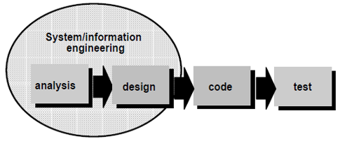
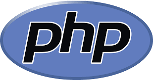
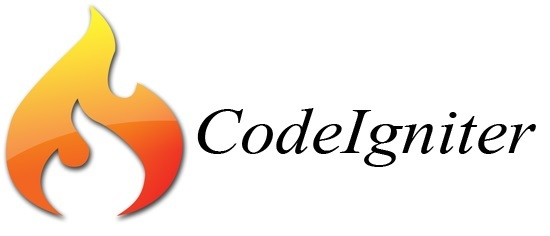

<h2 align="center">BAB II    LANDASAN TEORI </h2>
<strong>2.1	Pengertian UKM</strong>

&nbsp;&nbsp;&nbsp;&nbsp;&nbsp;Unit Kegiatan Mahasiswa (disingkat UKM) adalah wadah aktivitas kemahasiswaan luar kelas untuk mengembangkan minat, bakat dan keahlian tertentu. Lembaga ini merupakan partner organisasi kemahasiswaan intra kampus lainnya seperti senat mahasiswa dan badan eksekutif mahasiswa, baik yang berada di tingkat program studi, jurusan, maupun universitas. Lembaga ini bersifat otonom, dan bukan sebagai cabang dari badan eksekutif maupun senat mahasiswa.
 
Unit kegiatan mahasiswa terdiri dari tiga kelompok minat:
&nbsp;&nbsp;&nbsp;&nbsp;&nbsp;•	Unit kegiatan olahraga, (UKM Basket, UKM Futsal, UKM Bola Voli, UKM Renang)
&nbsp;&nbsp;&nbsp;&nbsp;&nbsp;•	Unit kegiatan kesenian. (UKM Band, UKM Tari, UKM Drama, UKM Seni dan Budaya dsb)
&nbsp;&nbsp;&nbsp;&nbsp;&nbsp;•	Unit kegiatan khusus (Pramuka, Resimen mahasiswa, Pers mahasiswa, Koperasi mahasiswa, Unit kerohanian, Mahasiswa Pecinta Alam (Mapala), dsb).[2]

 
<strong>2.2	Android</strong>

&nbsp;&nbsp;&nbsp;&nbsp;&nbsp;Android adalah sistem operasi yang berbasis Linux untuk telepon seluler seperti telepon pintar dan komputer tablet. Android menyediakan platform terbuka bagi para pengembang untuk menciptakan aplikasi mereka sendiri untuk digunakan oleh bermacam peranti bergerak. Awalnya, Google Inc. membeli Android Inc., pendatang baru yang membuat peranti lunak untuk ponsel. Kemudian untuk mengembangkan Android, dibentuklah Open Handset Alliance, konsorsium dari 34 perusahaan peranti keras, peranti lunak, dan telekomunikasi, termasuk Google, HTC, Intel, Motorola, Qualcomm, T-Mobile, dan Nvidia.
 
&nbsp;&nbsp;&nbsp;&nbsp;&nbsp;Pada saat perilisan perdana Android, 5 November 2007, Android bersama Open Handset Alliance menyatakan mendukung pengembangan standar terbuka pada perangkat seluler. Di lain pihak, Google merilis kode–kode Android di bawah lisensi Apache, sebuah lisensi perangkat lunak dan standar terbuka perangkat seluler. 
 
&nbsp;&nbsp;&nbsp;&nbsp;&nbsp;Di dunia ini terdapat dua jenis distributor sistem operasi Android. Pertama yang mendapat dukungan penuh dari Google atau Google Mail Services (GMS) dan kedua adalah yang benar–benar bebas distribusinya tanpa dukungan langsung Google atau dikenal sebagai Open Handset Distribution (OHD).[5]

 
<strong>2.3	Pengembangan Sistem dengan Metode Waterfall</strong>

&nbsp;&nbsp;&nbsp;&nbsp;&nbsp;Dalam perancangan aplikasi pada tugas akhir ini penulis menggunakan metode Waterfall. Metode Waterfall adalah metode yang menyarankan sebuah pendekatan yang sistematis dan sekuensial melalui tahapan-tahapan yang ada pada SDLC untuk membangun sebuah perangkat lunak. 
 
&nbsp;&nbsp;&nbsp;&nbsp;&nbsp;Gambar menjelaskan bahwa metode Waterfall menekankan pada sebuah keterurutan dalam proses pengembangan perangkat lunak. Metode ini adalah sebuah metode yang tepat untuk membangun sebuah perangkat lunak yang tidak terlalu besar dan sumber daya manusia yang terlibat dalam jumlah yang terbatas.
 

    
     
    Gambar 1.1 Pengembangan Sistem dengan Metode Waterfall
 
Berikut adalah penjelasan dari tahap-tahap yang dilakukan dalam metode waterfall:
 
&nbsp;&nbsp;&nbsp;&nbsp;&nbsp;a.	Tahap Requirements Definition. Pelayanan, batasan, dan tujuan sistem ditentukan melalui konsultasi dengan user sistem. Persyaratan ini kemudian didefinisikan secara rinci dan berfungsi sebagai spesifikasi sistem.
 
&nbsp;&nbsp;&nbsp;&nbsp;&nbsp;b.	Tahap System and Software Design. Proses perancangan sistem membagi persyaratan dalam sistem perangkat keras atau perangkat lunak. Kegiatan ini menentukan arsitektur sistem secara keseluruhan. Perancangan perangkat lunak melibatkan identifikasi dan deskripsi abstraksi sistem perangkat lunak yang mendasar dan hubungan-hubungannya.
 
&nbsp;&nbsp;&nbsp;&nbsp;&nbsp;c.	Tahap Implementasi dan Until Testing. Pada tahap ini, perancangan perangkat lunak direalisasikan sebagai serangkaian program atau unit program. Pengujian unit melibatkan verifikasi bahwa setiap unit telah memenuhi spesifikasinya.
 
&nbsp;&nbsp;&nbsp;&nbsp;&nbsp;d.	Tahap Integration System Testing. Unit program atau program individual diintegrasikan dan diuji sebagai sistem yang lengkap untuk menjamin bahwa persyaratan sistem telah dipenuhi. Setelah pengujian sistem, perangkat lunak dikirim kepada pelanggan.
 
&nbsp;&nbsp;&nbsp;&nbsp;&nbsp;e.	Tahap Operation and Maintenance. Biasanya (walaupun tidak seharusnya), ini merupakan fase siklus hidup yang paling lama. Sistem diinstal dan dipakai. Pemeliharaan mencakup koreksi dari berbagai error yang tidak ditemukan pada tahap-tahap terdahulu, perbaikan atas implementasi unit sistem dan pengembangan pelayanan sistem, sementara persyaratan-persyaratan baru ditambahkan.[2]

 
<strong>2.4	Unified Modelling Language (UML)</strong>

&nbsp;&nbsp;&nbsp;&nbsp;&nbsp;Unified Modelling Language (UML) bukanlah suatu proses melainkan bahasa pemodelan secara grafis untuk menspesifikasikan, memvisualisasikan, membangun, dan mendokumentasikan seluruh artifak sistem perangkat lunak. Penggunaan model ini bertujuan untuk mengidentifikasikan bagian-bagian yang termasuk dalam lingkup sistem yang dibahas dan bagaimana hubungan antara sistem dengan subsistem maupun sistem lain diluarnya.
 
Dengan pemodelan menggunakan UML, pengembang dapat melakukan:
 
&nbsp;&nbsp;&nbsp;&nbsp;&nbsp;1.	Tinjauan umum bagaimana arsitektur sistem secara keseluruhan.
 
&nbsp;&nbsp;&nbsp;&nbsp;&nbsp;2.	Penelaahan bagaimana objek-objek dalam sistem saling mengirimkan pesan dan saling bekerjasama satu sama lain.
 
&nbsp;&nbsp;&nbsp;&nbsp;&nbsp;3.	Menguji apakah sistem perangkat lunak sudah berfungsi seperti seharusnya.
 
&nbsp;&nbsp;&nbsp;&nbsp;&nbsp;4.	Dokumentasi sitem perangkat lunak untuk keperluan-keperluan tertentu dimasa yang akan datang.
 
UML menyediakan 3 jenis diagram yang dapat dikelompokkan berdasarkan sifatnya, yaitu:
 
&nbsp;&nbsp;&nbsp;&nbsp;&nbsp;a.	Use Case Diagram adalah suatu kumpulan urutan interaksi diantara user dengan sistem untuk mencapai suatu
tujuan dimana use case ini menggambarkan kebutuhan fungsional suatu sistem tanpa menampilkan struktur internal system.
 
&nbsp;&nbsp;&nbsp;&nbsp;&nbsp;b.	Sequence Diagram adalah Sequence diagram digunakan untuk menggambarkan event yang dilakukan aktor eksternal pada sistem atau inter system event dilihat dalam satu use case.
 
&nbsp;&nbsp;&nbsp;&nbsp;&nbsp;c.	Activity Diagram adalah Representasi secara grafis dari proses dan control flow dan berfungsi untuk memperlihatkan alur dari satu aktivitas ke aktivitas yang lain serta menggambarkan perilaku yang kompleks.[8]

 
<strong>2.5	PHP</strong>

    
     
    Gambar 1.2 PHP

&nbsp;&nbsp;&nbsp;&nbsp;&nbsp;PHP (Personal Homepage, namun lebih populer sebagai Hypertext Proproser) merupakan bahasa scripting yang bersifat server side, yang diartikan bahwa kode PHP akan dieksekusi oleh webserver dan hasil eksekusi tersebut akan dikirim dalam bentuk HTML ke browser <i>client</i>. HTML merupakan file umum yang dijalankan oleh browser. Dengan demikian , client tidak dapat melihat kode PHP yang dibuat oleh developer website, tetapi hanya bisa melihat kode HTML yang merupakan hasil olahan dari Engine PHP. Agar webserver (Apache) dapat mengolah file PHP ini maka diperlukan aplikasi PHP yang kita sebut sebagai Engine PHP untuk ditanamkan bersama aplikasi weberver tersebut.[4]

 
<strong>2.6	Database</strong>

&nbsp;&nbsp;&nbsp;&nbsp;&nbsp;Database merupakan media yang digunakan untuk menampung data. Ada beberapa macam database, anatara lain Oracle, Microsoft Access, Microsoft SQL Server, MySQL dan lain. Seperti ini dijelaskan di atas bahwa Joomla diciptakan dengan menggunakan bahasa scripting PHP dan database MySQL maka kita akan menggunakan database ini untuk menampung data-data Joomla milik kita, seperti artikel, user password dan lain-lain.[4]

 
<strong>2.7	XAMPP</strong>

&nbsp;&nbsp;&nbsp;&nbsp;&nbsp;XAMPP adalah perangkat lunak gratis yang mendukung banyak sistem operasi dan merupakan kompilasi dari beberapa program. Fungsinya adalah sebagai server yang terdiri sendiri (localhost), yang terdiri atas program Apache HTTP Server, MySQL database, dan penterjemah bahasa yang ditulis dengan bahasa pemograman PHP dan Perl. Nama XAMPP merupakan singkatan dari X (empat sistem operasi apapun), Apache, MySQL, PHP dan Perl. Program ini tersedia dalam GNU General Public Lisensi dan bebas, merupakan web server yang mudah digunakan yang dapat melayani tampilam halaman web yang dinamis.
 
Mengenal bagian XAMPP yang biasa digunakan pada umumnya:
&nbsp;&nbsp;&nbsp;&nbsp;&nbsp;a.	htdoc adalah folder tempat meletakkan berkas-berkas yang akan dijalankan, seperti berkas PHP, HTML dan skrip lain.
 
&nbsp;&nbsp;&nbsp;&nbsp;&nbsp;b.	phpMyAdmin merupakan bagian untuk mengelola basis data MySQL yang ada dikomputer. Untuk membukanya, buka browser lalu ketikkan alamat http://localhost/phpMyAdmin, maka akan muncul halaman phpMyAdmin.
 
&nbsp;&nbsp;&nbsp;&nbsp;&nbsp;c.	Kontrol Panel yang berfungsi untuk mengelola layanan (service) XAMPP. Seperti menghentikan (stop) layanan, ataupun memulai (start).[6]

 
<strong>2.8	MySQL</strong>

    
     
    Gambar 1.3 MySQL

&nbsp;&nbsp;&nbsp;&nbsp;&nbsp;MySQL adalah sebuah perangkat lunak sistem manajemen basis data SQL(database management system) atau DBMS yang multithread, multi-user, dengan sekitar 6 juta instalasi di seluruh dunia. MySQL AB membuat MySQL tersedia sebagai perangkat lunak gratis dibawah lisensi GNU/General Public License(GPL), tetapi mereka juga menjual dibawah lisensi komersial untuk kasus-kasus dimana penggunaannya tidak cocok dengan penggunaan GPL. Tidak sama dengan proyek-proyek seperti Apache, dimana perangkat lunak dikembangkan oleh komunitas umum, dan hak cipta untuk kode sumber dimiliki oleh penulisnya masing-masing, MySQL dimiliki dan disponsori oleh sebuah perusahaan komersial Swedia MySQL AB, dimana memegang hak cipta hampir atas semua kode sumbernya.[4]

 
<strong>2.9	CodeIgnite</strong>

    
     
    Gambar 1.4 Codeignoter

&nbsp;&nbsp;&nbsp;&nbsp;&nbsp;CodeIgniter merupakan aplikasi sumber terbuka yang berupa framework PHP dengan model MVC(Model, View, Controller) untuk membangun website dinamis dengan menggunakan PHP.  Codeigniter memudahkan developer untuk membuat aplikasi web dengan cepat mudah dibandingkan dengan membuatnya dari awal.[3]

